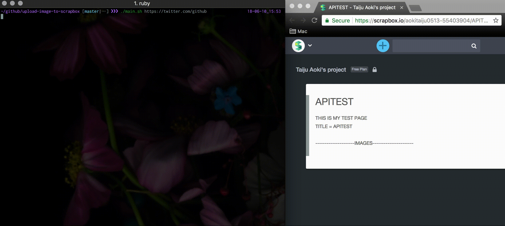

# Upload Image to Scrapbox

## What It Is
You can upload images to your scrapbox project via CLI.



## Setup

#### 1. Install Gem
```sh
$ bundle install
```

#### 2. Edit Config
```config
project=[YOUR_SCRAPBOX_PROJECT_NAME]
title=[YOUR_SCRAPBOX_TITLE]
access_token=[YOUR_SCRAPBOX_ACCESS_TOKEN]
base_file_path=[YOUR_WORKING_DIRECTORY]
```

## How to Use

So Simple!!

```sh
$ ./main.sh [URL]
```
